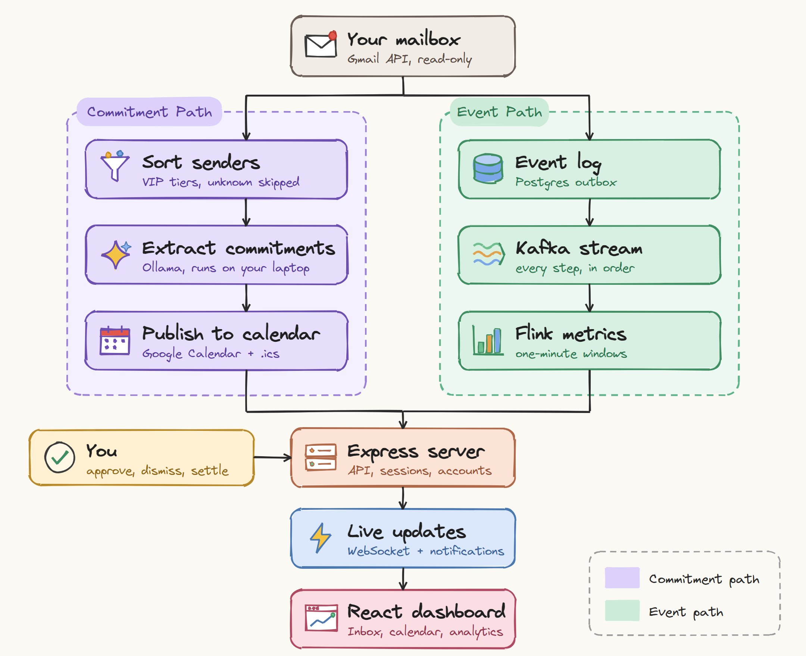

# CommitMail: Email Commitment Tracker

## Description

CommitMail finds the promises hidden in your email and puts them on your calendar. A line like "could you send me the Q3 report by Friday?" is easy to agree to and easy to forget, because the only record of it is an email you have already read.

The app reads mail from the people you care about, uses an AI model to pick out the commitments, and adds them to Google Calendar or any calendar app that supports `.ics`. The AI runs on your own laptop through Ollama, so your email is never sent to an AI company.

**Live demo:** [jaydeep-k18.github.io/email-commitment-tracker](https://jaydeep-k18.github.io/email-commitment-tracker/) (runs on sample data in your browser, no sign-up)

## Tech Stack

- **Languages:** TypeScript, Python
- **Frontend:** React, Vite, TanStack Query, Tailwind CSS, Recharts
- **Backend:** Node.js, Express, WebSockets
- **Worker:** FastAPI, SQLAlchemy, Alembic
- **AI:** Ollama (Llama 3.2, running locally)
- **Database:** PostgreSQL with row-level security, Redis
- **Streaming:** Apache Kafka, Apache Flink (PyFlink)
- **Integrations:** Gmail API, Google Calendar API, Chrome extension (Manifest V3)
- **Testing:** pytest, Vitest, Playwright, GitHub Actions

## Architecture

## Key Features

- Turns deadlines, requests and meetings in your email into calendar events
- The AI model runs on your laptop, so email content never leaves it
- Only reads mail from contacts you mark as important; unknown senders are skipped
- Smart inbox with categories, search, tags, starring and bulk actions
- Flags calendar clashes and possible duplicates, and suggests free times instead
- Gmail side panel to add any open email to your calendar
- Live dashboard with analytics, background job tracking and system health
- Every account's data is kept separate by the database itself

## Challenges Faced

- Wrong dates: The small local model could not work out what "by Friday" meant and gave confident but wrong dates. The prompt now includes a table of the next seven days, so the model reads the date instead of calculating it.
- Made-up evidence: The model sometimes copied a sentence from its own prompt as proof of a commitment. Every quote is now checked against the actual email before it is saved.
- Polite phrases saved as tasks: Lines like "let me know if you have any questions" kept showing up as commitments. Telling the model not to do this did not work, so a filter in the code now removes them.
- Google Calendar rejected events: Events without a time zone worked fine in `.ics` files, but Google refused them. This only showed up on the first real sync.
- Expired Google sign-ins: Google ends sign-ins after seven days for apps in testing mode, and the app kept retrying jobs that could never succeed. It now tells you to sign in again and catches up by itself afterwards.
- Idle event stream: Flink's normal time windows only close when a new event arrives, so on a quiet inbox the latest minute never closed. Minutes are now closed on a timer instead.

