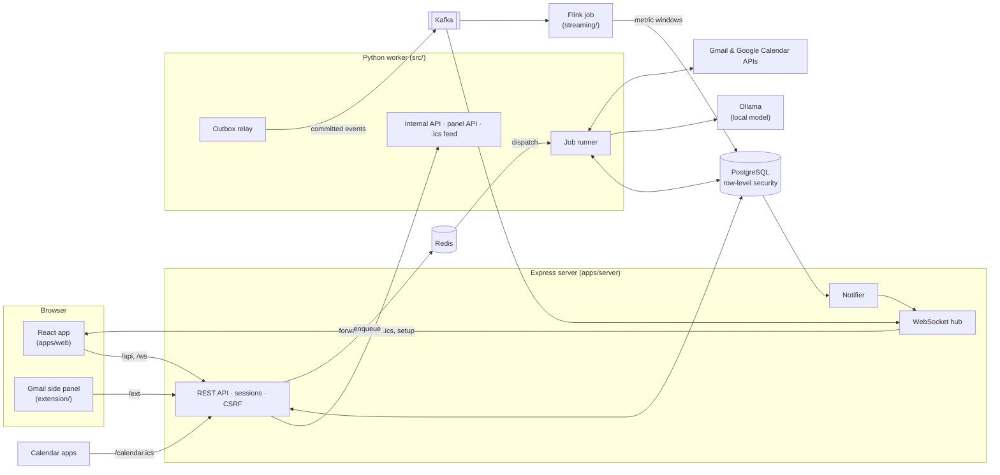
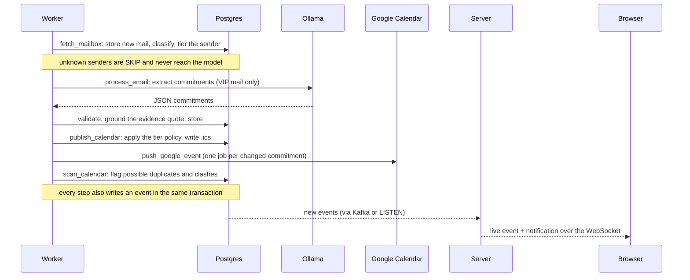

# Architecture

How CommitMail is put together, and why. The README says what it does; this says how the
parts fit, where the guarantees come from, and what was traded for them.

## The shape of it

A PERN application around a Python pipeline. PostgreSQL is the single source of truth.
The browser only ever talks to the Express server; the Python worker does the reading,
extracting and publishing as background jobs. Everything runs on the owner's machine,
including the language model.

Kafka and Flink are optional. Without Kafka the server reads new events straight from
Postgres (LISTEN/NOTIFY plus a cursor); without Flink it computes the same metrics with SQL.
Without Redis, jobs are dispatched by polling the jobs table. Nothing is lost in any of
those modes, only latency.

## One email's journey

The steps that matter for trust are in `src/extraction/`: a date lookup table so the model
reads dates instead of computing them, an evidence check that rejects quotes the email
does not contain, and a boilerplate filter. Each exists because of a failure seen on real
mail; the README tells those stories.

## Data and ownership

Every per-user table carries `user_id`. The schema is owned by Alembic (`migrations/`);
the Node server never alters it. Its exact DDL is exported to
`packages/shared/contracts/schema.sql`, which the server's tests load into PGlite
(Postgres compiled to WebAssembly), so they run against the real schema, policies and all.

**Isolation is enforced by the database, not by remembering a WHERE clause** (migration
0005):

- Requests and jobs run as the `commitmail_tenant` role, with `app.user_id` set for the
  transaction. Row-level security shows, inserts and changes only that user's rows, and
  `user_id` defaults to the current user, so inserts need not name it.
- With no user set, a query sees nothing: a lost context fails closed, never open.
- Both settings are `LOCAL`, so they end with the transaction and cannot leak into the next
  request that borrows the same pooled connection.
- In the server, the user comes from AsyncLocalStorage, set by `requireAuth`
  (`apps/server/src/db/tenant.ts`). Route code queries as if it were single-user and cannot
  forget to filter.
- In the worker, `acting_as(user_id)` (`src/storage/tenancy.py`) does the same, and the ORM
  also adds the user to every query and refuses to write a row naming anyone else.
- Sign-in, the notifier, the live feeds and health checks need to see across users; they
  use a separate system connection, which only background code and the auth routes hold.

`apps/server/test/isolation.test.ts` signs in a second account and tries every route at
the first one's data: listing, fetching by id, changing, bulk changes, attaching a
borrowed tag id, export and purge. It sees and changes nothing.

## Background jobs

The jobs table is the job; Redis only carries ids to workers and holds delayed retries.
If Redis were wiped, every job's state would still be in Postgres, and a sweeper
re-dispatches anything runnable that Redis has lost.

- **Idempotency.** Each job has a key, unique per user (`process_email:42`); enqueueing
  the same work twice is a no-op. Google pushes are keyed by a hash of the event body, so an
  unchanged commitment costs no API call and two pushes of the same content cannot coexist.
- **Retries** use exponential backoff with jitter. A `PermanentJobError` (Google refused
  the sign-in, an unknown job type) fails at once rather than retrying pointlessly.
- **Leases.** A running job holds a lease; a worker that dies mid-run is detected when the
  lease lapses, and the job is handed back out.
- Jobs dispatch only after their transaction commits, so a worker never picks up a row it
  cannot see yet or one that is about to roll back.

## Events, streaming and metrics

One `events` table is the activity timeline, the source of notifications, and a
**transactional outbox**. An event is written in the same transaction as the change it
describes; the relay publishes committed events to Kafka afterwards. So the stream can
never announce a change the database rolled back, or miss one it kept.

Delivery is at least once, so every consumer is idempotent: the server remembers recent
event ids, the notifier inserts with `ON CONFLICT DO NOTHING`, and Flink counts each id
once.

The Flink job (`streaming/job.py`) turns the stream into one-minute windows: events, mail
processed, job success rate, mean and p95 latency, failures, and two flags (error spike,
volume anomaly) judged against the trailing hour. Minutes close by the wall clock, not by
watermarks: event-time windows only close when a later event arrives, and this stream is
quiet most of the time, so the newest minute would wait and an empty one would never be
written. A minute is written 15 s after it ends, empty or not, and rewritten if a straggler
arrives.

The rules live once in Python (`streaming/window_metrics.py`) and once in TypeScript for
the SQL fallback (`packages/shared/src/metrics.ts`). A contract file generated from the
Python (`contracts/metric-windows.json`) holds the two to the same numbers.

## The calendar

Whether a commitment goes on the calendar is one function, `decide()`: questions never;
CRITICAL and IMPORTANT senders automatically; MONITOR only once approved; SKIP only when
picked by hand in the Gmail panel. Python and TypeScript each have a copy, and a
400-case contract (`sync-decisions.json`) keeps them identical.

Two passes keep the calendar honest. The conflict resolver merges clear revisions (same
type, same person, same subject) by itself. `scan_calendar` (`src/sync/calendar_intel.py`)
finds what it must not decide alone: possible duplicates, including invites already on the
user's Google Calendar, and meetings that clash, each with free slots in working hours. It
flags them for the user and never fixes them automatically.

## Security model

| Threat | Defence |
|---|---|
| Another account reading your mail | Postgres row-level security under a tenant role; fail-closed context; tested route by route |
| Cross-site request forgery | Origin allow-list, plus a per-session CSRF token on every state-changing request, plus `SameSite=Strict` cookies |
| Session theft | `HttpOnly` cookie; only a SHA-256 of the token is stored; logout deletes it; a password change signs out other sessions |
| Password guessing | argon2id; 5 failures per 15 minutes per address; constant-time verification even for unknown emails |
| Cross-site scripting | Strict Content-Security-Policy (`script-src 'self'`, `frame-ancestors 'none'`), React escaping |
| Cross-site WebSocket hijacking | The WebSocket checks Origin and the session on the upgrade |
| "It's only localhost" | Loopback is not a boundary: the panel API needs a token, the worker's internal API a shared secret compared in constant time |
| Your mail reaching an AI company | The model runs locally through Ollama; nothing else sees email content |
| Credentials on disk | Mailbox and Google sign-ins live in the OS keyring, never in `.env` or the database |

The end-to-end suite checks several of these against the running server: headers, the
cookie's flags, a forged cross-site sign-in, a change without the CSRF token, the rate
limit, and one user opening another's email by its URL.

## Testing

| Layer | Tool | What it covers |
|---|---|---|
| Python worker | pytest, throwaway SQLite | Extraction, filtering, jobs, sync, calendar intelligence, migrations both ways |
| Shared contracts | Vitest | The TypeScript copies of the tier policy and metric rules against Python's outputs |
| Server | Vitest + supertest on PGlite | Every route on the real schema with row-level security enforced |
| Web | Vitest + Testing Library + MSW | Pages and components through the app's real request code |
| End to end | Playwright | The built app in Chromium against the real server and Postgres; the demo build as published |

CI (`.github/workflows/ci.yml`) runs all of it on every push. The Python suite runs with
`DATABASE_URL` pointing at a port nothing listens on, so a test that reached for a real
database would fail rather than touch it.

## Where it runs

On the owner's machine: Docker Compose for Postgres, Redis, Kafka and Flink; the worker,
the server and the web app as local processes; Ollama for the model. The public
[live demo](https://jaydeep-k18.github.io/email-commitment-tracker/) is the web app's demo
mode on GitHub Pages: generated sample mail answered by a service worker in the visitor's
browser, with no server behind it at all.

## Trade-offs, briefly

- **Local model over a hosted one.** Slower and less capable, but no email content ever
  leaves the machine. Most of the extraction engineering exists to make a small model
  trustworthy.
- **An outbox over publishing to Kafka directly.** One extra hop and a relay to run, in
  exchange for never disagreeing with the database.
- **Row-level security over application filters.** A little more setup per transaction,
  in exchange for isolation that holds even where a query forgets.
- **Wall-clock windows over watermarks.** Less textbook, but correct for a stream that is
  idle most of the time.
- **Flag, don't fix.** Possible duplicates and clashes wait for the user, because merging
  two different obligations is worse than asking.
